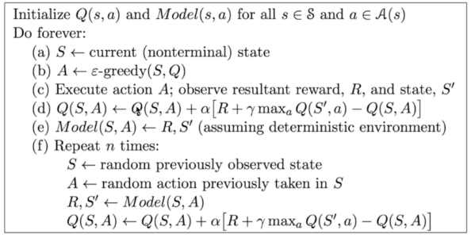

# 前言
- 强化学习可以分为**有模型**和**无模型**的方法两大类
- 未知模型
  - 学习法
  - 通过智能体的交互，学习值函数和策略
  - 代表方法：MC，TD
- 已知模型
  - 规划法
  - 无需智能体交互，直接从模型学习最优策略
  - 代表方法：DP

# 基于模型的强化学习
## 核心思路
- 通过经验，学习出一个虚拟的环境模型
- 利用学到的环境模型，进行动态规划，计算价值函数或者策略

## 优势
- 可以通过监督学习，有效地学习环境模型
- 可以将学到的环境模型放在GPU内，快速得到大量的交互信息
- 没有任何真实损失
- 直接利用环境模型的不确定性

## 劣势
- 先学环境模型，再学值函数，存在两次近似误差 -> 累计误差

## Dyna-q
- 算法流程
- 